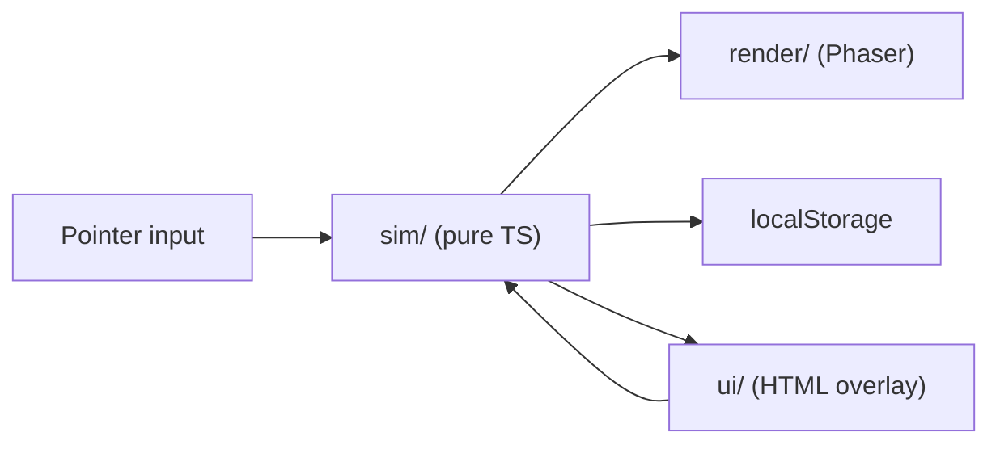

# Architecture

## Overview

The game separates **simulation** (pure TypeScript) from **rendering** (Phaser 4) and **UI** (DOM overlay).

## Data flow

1. **TankScene.update()** calls `advance(state, dt)` each frame.
2. Simulation updates fish AI, hunger, algae spawning/lifetime, tilapia eating algae, bass hunting smaller fish, fish feed passive growth, and buff timers — no Phaser imports.
3. **TankScene** reads entity positions and syncs Phaser sprites by entity `id`.
4. Pointer clicks call sim functions (`sellFish`, `removeDeadFish`, shop purchase actions).
5. HUD reads `GameState` every frame; the Shop re-renders only when money or buffs change (after purchases or sales) so button elements are not destroyed mid-click.
6. **save.ts** serializes fish, money, and entity IDs to `localStorage` every 10 seconds (algae and buff timers are not persisted — they reset on load).

## Page layout and scale

The HTML shell uses a `#stage` wrapper around `#game-container` and `#ui-overlay`:

- `#game-container` has a fixed aspect ratio (`4 / 3`) and `width: min(800px, calc(100vw - 32px))` so Phaser's `Scale.FIT` has a stable box to measure.
- `#ui-overlay` is `position: absolute` inside `#stage`, keeping the HUD and Shop aligned with the tank rather than the browser window.
- `expandParent: false` in [src/main.ts](../src/main.ts) prevents Phaser from resizing the parent and creating a scale-up feedback loop.

## Entity sync pattern

Each sim entity has a numeric `id`. Phaser maintains `Map<id, Sprite>`:

- Create sprite when entity appears.
- Update position/texture each frame, selecting from 4 animated tail frames based on `fish.swimPhase`.
- Apply sprite tints and alpha for hunger state (white when fed, warm amber when hungry, pale when starving, gray when dead).
- Destroy sprite when entity is removed.

## Why this split

- Save/load is trivial (plain JSON objects).
- Balance tuning is one file (`balance.ts`).
- Procedural textures can be swapped for image sprites later without touching sim code.
